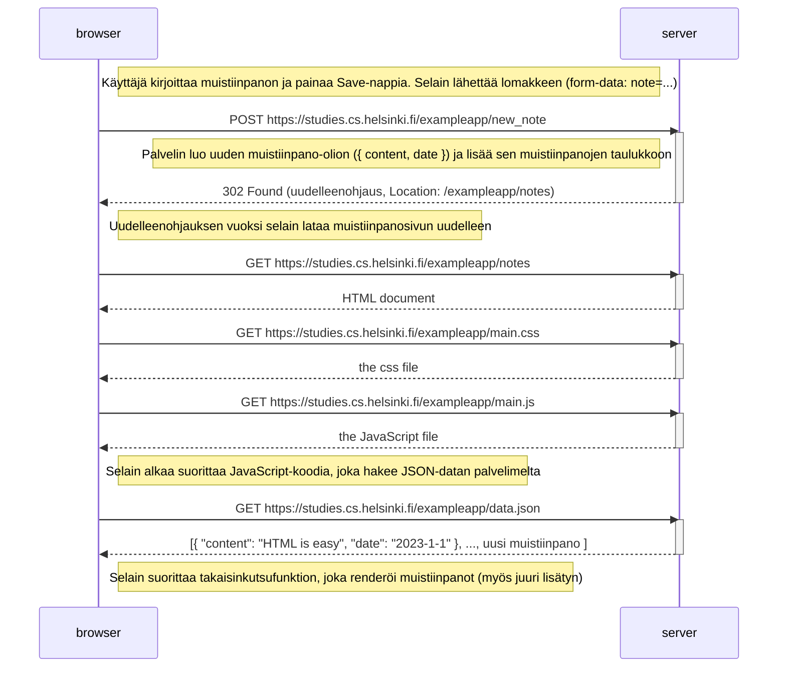

# 0.4: Uusi muistiinpano

Käyttäjä on sivulla https://studies.cs.helsinki.fi/exampleapp/notes, kirjoittaa tekstikenttään muistiinpanon ja painaa _Save_-nappia.

```mermaid
sequenceDiagram
    participant browser
    participant server

    Note right of browser: Käyttäjä kirjoittaa muistiinpanon ja painaa Save-nappia. Selain lähettää lomakkeen (form-data: note=...)

    browser->>server: POST https://studies.cs.helsinki.fi/exampleapp/new_note
    activate server
    Note left of server: Palvelin luo uuden muistiinpano-olion ({ content, date }) ja lisää sen muistiinpanojen taulukkoon
    server-->>browser: 302 Found (uudelleenohjaus, Location: /exampleapp/notes)
    deactivate server

    Note right of browser: Uudelleenohjauksen vuoksi selain lataa muistiinpanosivun uudelleen

    browser->>server: GET https://studies.cs.helsinki.fi/exampleapp/notes
    activate server
    server-->>browser: HTML document
    deactivate server

    browser->>server: GET https://studies.cs.helsinki.fi/exampleapp/main.css
    activate server
    server-->>browser: the css file
    deactivate server

    browser->>server: GET https://studies.cs.helsinki.fi/exampleapp/main.js
    activate server
    server-->>browser: the JavaScript file
    deactivate server

    Note right of browser: Selain alkaa suorittaa JavaScript-koodia, joka hakee JSON-datan palvelimelta

    browser->>server: GET https://studies.cs.helsinki.fi/exampleapp/data.json
    activate server
    server-->>browser: [{ "content": "HTML is easy", "date": "2023-1-1" }, ..., uusi muistiinpano ]
    deactivate server

    Note right of browser: Selain suorittaa takaisinkutsufunktion, joka renderöi muistiinpanot (myös juuri lisätyn)
```
