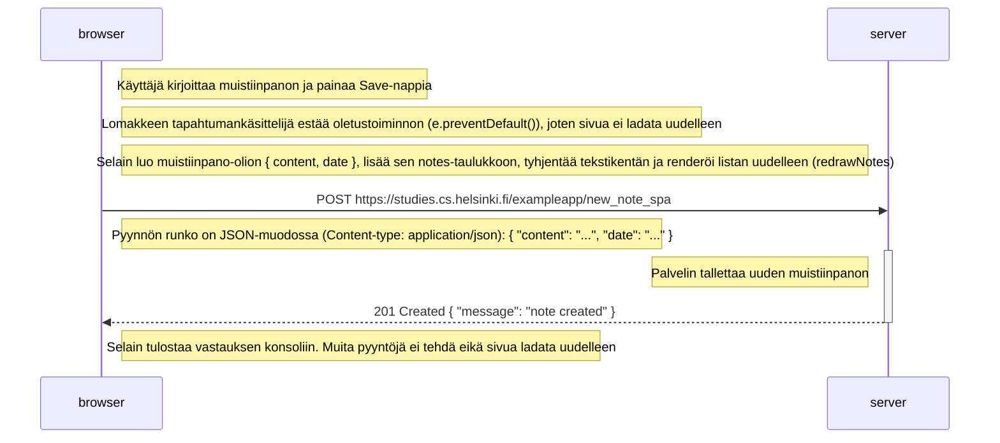

# 0.6: Uusi muistiinpano (SPA)

Käyttäjä luo uuden muistiinpanon Single Page App -versiossa (https://studies.cs.helsinki.fi/exampleapp/spa).

```mermaid
sequenceDiagram
    participant browser
    participant server

    Note right of browser: Käyttäjä kirjoittaa muistiinpanon ja painaa Save-nappia
    Note right of browser: Lomakkeen tapahtumankäsittelijä estää oletustoiminnon (e.preventDefault()), joten sivua ei ladata uudelleen
    Note right of browser: Selain luo muistiinpano-olion { content, date }, lisää sen notes-taulukkoon, tyhjentää tekstikentän ja renderöi listan uudelleen (redrawNotes)

    browser->>server: POST https://studies.cs.helsinki.fi/exampleapp/new_note_spa
    Note right of browser: Pyynnön runko on JSON-muodossa (Content-type: application/json): { "content": "...", "date": "..." }
    activate server
    Note left of server: Palvelin tallettaa uuden muistiinpanon
    server-->>browser: 201 Created { "message": "note created" }
    deactivate server

    Note right of browser: Selain tulostaa vastauksen konsoliin. Muita pyyntöjä ei tehdä eikä sivua ladata uudelleen
```
